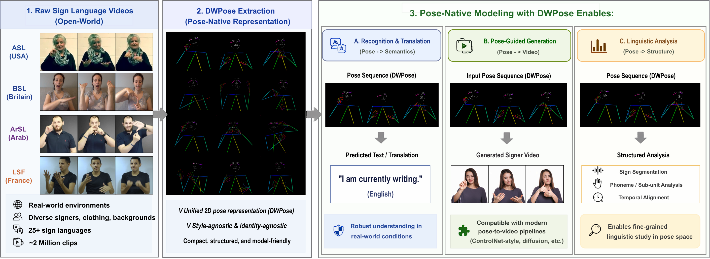

# SignVerse-2M

**Pose preprocessing and SignDW Transformer baseline code**

This repository contains the engineering code for DWPose-based sign language pose preprocessing and the initial SignDW Transformer baseline. The README focuses on code paths, pose format, scripts, and reproducible commands.

The main implementation lives in `SignDW_Transformer/`.



## What Is Included

- A staged video-to-DWPose preprocessing pipeline.
- A person-centric `poses.npz` storage format for body, hand, and face keypoints.
- Utilities for visualization, status tracking, CSV synchronization, and Hugging Face upload.
- A compact text-to-DWPose Transformer baseline with training, evaluation, checkpointing, and inference.
- Project-page assets and paper materials under `static/` and `doc/`.

## Repository Layout

```text
SignVerse-2M/
|-- README.md
|-- index.html
|-- doc/
|   |-- 01_abstract.md
|   |-- 02_method.md
|   |-- 03_experiment.md
|   |-- 04_summary.md
|   `-- 07_bibtex.md
|-- static/
|   |-- images/
|   `-- paper/SignVerse-2M_paper.pdf
`-- SignDW_Transformer/
    |-- train_SignDW_Transformer.py
    |-- scripts/
    |   |-- pipeline01_download_video_fix_caption.py
    |   |-- pipeline02_extract_dwpose_from_video.py
    |   |-- pipeline03_upload_to_huggingface.py
    |   |-- runtime_status.py
    |   |-- sync_processed_csv_from_runtime.py
    |   `-- visualize_dwpose_npz.py
    `-- utils/
        |-- draw_dw_lib.py
        |-- dataset_pool.py
        |-- raw_video_pool.py
        |-- stats_npz.py
        `-- Sign-DWPose-2M-metadata_ori.csv
```

## Environment

The repository currently does not include a pinned `requirements.txt`, so the following is a practical minimal environment based on the code:

```bash
conda create -n signverse2m python=3.10 -y
conda activate signverse2m

pip install numpy opencv-python pillow matplotlib tqdm
pip install torch torchvision --index-url https://download.pytorch.org/whl/cu121
pip install onnxruntime-gpu huggingface_hub yt-dlp
```

Additional system tools:

- `ffmpeg` and `ffprobe` for video decoding and rendering;
- `easy_dwpose` and its DWPose ONNX checkpoints for pose extraction;
- optional SLURM commands for `runtime_status.py` on cluster runs;
- optional Hugging Face credentials for dataset upload.

The optimized DWPose path expects checkpoint files such as:

```text
checkpoints/yolox_l.onnx
checkpoints/dw-ll_ucoco_384.onnx
```

## Quick Start

From the baseline directory:

```bash
cd SignDW_Transformer
```

List available sign-language groups in the local dataset:

```bash
python train_SignDW_Transformer.py \
  --mode train \
  --sign-language list
```

Train the default SignDW Transformer baseline:

```bash
python train_SignDW_Transformer.py \
  --mode train \
  --dataset-dir dataset \
  --metadata-csv utils/Sign-DWPose-2M-metadata_ori.csv \
  --sign-language auto \
  --max-videos 100 \
  --max-steps 20000 \
  --batch-size 120
```

Training requires a CUDA GPU. Outputs are written to a timestamped directory:

```text
log/<YYYYMMDD_HHMMSS>/
|-- args.json
|-- split_manifest.json
|-- stats.json
|-- stats.png
|-- best.pth
|-- step_XXXXXXXX.pth
`-- step_XXXXXXXX/
    |-- prediction.mp4
    `-- comparison.mp4
```

Run inference from a trained checkpoint:

```bash
python train_SignDW_Transformer.py \
  --mode infer \
  --checkpoint log/<run_id>/best.pth \
  --text "your input subtitle or prompt here" \
  --output-video log/inference.mp4
```

## SignDW Transformer Baseline

`train_SignDW_Transformer.py` implements a compact text-to-DWPose Transformer baseline:

- multilingual subtitle tokenization with a lightweight vocabulary;
- train/test split by video ID to avoid segment leakage;
- optional filtering by sign-language code from metadata;
- text encoder with sinusoidal positional encoding;
- autoregressive Transformer decoder over pose frames;
- teacher forcing during training;
- masked pose reconstruction loss and auxiliary length loss;
- optional center-square coordinate transform;
- optional pose normalization and Gaussian noise augmentation;
- periodic evaluation, checkpointing, and rendered pose-video samples.

Important training options:

```text
--sign-language auto|list|<code>  choose language group
--max-videos N                   cap number of videos after language filtering; 0 disables cap
--max-text-len N                 maximum token sequence length
--max-pose-frames N              maximum generated pose frames
--hidden-dim N                   Transformer hidden size
--encoder-layers N               number of text encoder layers
--decoder-layers N               number of pose decoder layers
--batch-by-video                 group batches by video, enabled by default
--random-segment-batches         use ordinary shuffled segment batches
--amp                            enable mixed precision
--render-every N                 render prediction/comparison videos periodically
```

## Run Preprocessing Locally

Prepare metadata, subtitles, and videos:

```bash
cd SignDW_Transformer

python scripts/pipeline01_download_video_fix_caption.py \
  --source-metadata-csv utils/Sign-DWPose-2M-metadata_ori.csv \
  --output-metadata-csv SignVerse-2M-metadata_processed.csv \
  --raw-video-dir raw_video \
  --raw-caption-dir raw_caption \
  --raw-metadata-dir raw_metadata \
  --dataset-dir dataset \
  --limit 10
```

Extract DWPose:

```bash
python scripts/pipeline02_extract_dwpose_from_video.py \
  --raw-video-dir raw_video \
  --dataset-dir dataset \
  --fps 24 \
  --workers 1 \
  --optimized-provider cuda
```

Visualize one processed video:

```bash
python scripts/visualize_dwpose_npz.py \
  --video-dir dataset/<video_id> \
  --draw-style controlnext \
  --max-frames 240 \
  --force
```

Upload archive shards to Hugging Face:

```bash
python scripts/pipeline03_upload_to_huggingface.py \
  --dataset-dir dataset \
  --archive-dir archives \
  --repo-id SignerX/SignVerse-2M \
  --upload-mode api
```

Use `--dry-run` before a real upload when checking shard composition.

## Monitoring Large Runs

For cluster/runtime processing, the repository includes status helpers:

```bash
python scripts/runtime_status.py \
  --runtime-root /path/to/SignVerse-2M-runtime \
  --username <user> \
  --include-partitions \
  --scan-complete
```

JSON output is available with:

```bash
python scripts/runtime_status.py --json
```

The status tools summarize raw-video counts, completed pose folders, active download/DWPose jobs, upload progress, CSV consistency, filesystem capacity, and optional SLURM partition capacity.

## Engineering Notes

- Training requires CUDA; inference can run on CUDA or CPU.
- `pipeline02_extract_dwpose_from_video.py` expects DWPose ONNX checkpoints when optimized mode is enabled.
- `poses.npz` is the preferred downstream interface; raw video is treated as an intermediate artifact.
- Large runs should use the status files and completion markers instead of assuming a one-shot preprocessing pass.
- The repository currently does not pin all dependency versions, so environment reproducibility should be tightened before archival release.

## Citation

```bibtex
@misc{fang2026signverse2mtwomillionclipposenativeuniverse,
      title={SignVerse-2M: A Two-Million-Clip Pose-Native Universe of 55+ Sign Languages}, 
      author={Sen Fang and Hongbin Zhong and Yanxin Zhang and Dimitris N. Metaxas},
      year={2026},
      eprint={2605.01720},
      archivePrefix={arXiv},
      primaryClass={cs.CV},
      url={https://arxiv.org/abs/2605.01720}, 
}
```
